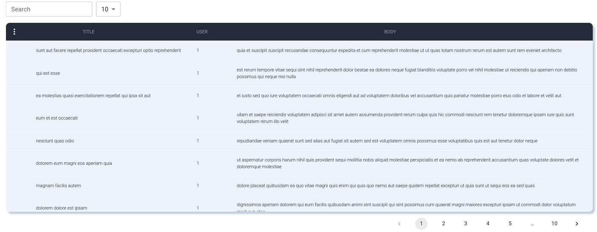

# Getting Started with Create React App

This project was bootstrapped with [Create React App](https://github.com/facebook/create-react-app).

## Available Scripts

In the project directory, you can run:

### `npm start`

Runs the app in the development mode.\
Open [http://localhost:3000](http://localhost:3000) to view it in your browser.

The page will reload when you make changes.\
You may also see any lint errors in the console.
### How to import the package
```
import DataGrid from "./Homepage/datagrid-by-mino-randy";
```
### Images:
  

### Integral code:
```
import React, { useEffect, useState } from "react";

import axios from "axios";
import DataGrid from "./Homepage/datagrid-by-mino-randy";


function HomePage() {
  const [data, setData] = useState([]);
  useEffect(() => {
    const fetchData = async () => {
      const response = await axios.get(
        "https://jsonplaceholder.typicode.com/posts"
      );
      setData(response.data);
    };

    fetchData();

  }, []);

  return (
    <div>
      <DataGrid
        data={data}
        columns={columns}
        options
        pageSize={5}
        rowsPerPageOptions={options}
        columnHeight={3}
        // noGlobalSearch
        paginations
        headPositionText={'center'}
        bodyPositionText={'center'}
      />
    </div>
  );
}

export default HomePage;

const columns = [
  { field: "title", headerName: "TITLE", width: 200 },
  { field: "userId", headerName: "USER", width: 50  },
  { field: "body", headerName: "BODY  ", width: 450 },
];
const options = [
  {
    value: 5,
    label: "Five",
  },
  {
    value: 10,
    label: "Ten",
  },
  {
    value: 20,
    label: "Twenty",
  },
];

``` 
